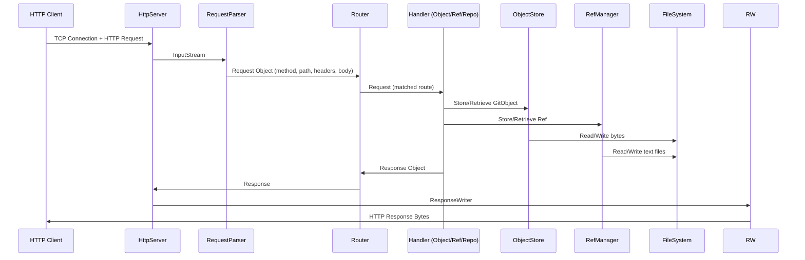

# Mini-Git Technical Specification

## 1. System Architecture Overview

### Design Pattern: Layered Architecture with Hexagonal Elements

The Mini-Git system follows a **Layered Architecture** pattern with hexagonal (ports and adapters) characteristics. The architecture separates concerns into distinct layers:

```
┌─────────────────────────────────────────────────────────────┐
│                    HTTP Server Layer                        │
│  ┌─────────────┐  ┌─────────────┐  ┌─────────────────────┐ │
│  │   Router    │  │RequestParser│  │   ResponseWriter    │ │
│  └─────────────┘  └─────────────┘  └─────────────────────┘ │
├─────────────────────────────────────────────────────────────┤
│                   Handler Layer                             │
│  ┌──────────────┐  ┌──────────────┐  ┌──────────────────┐ │
│  │ObjectHandlers│  │RefHandlers   │  │RepositoryHandlers│ │
│  └──────────────┘  └──────────────┘  └──────────────────┘ │
├─────────────────────────────────────────────────────────────┤
│                    Core Domain Layer                        │
│  ┌─────────────┐  ┌─────────────┐  ┌────────────────────┐ │
│  │ ObjectStore │  │ RefManager  │  │    Repository      │ │
│  └─────────────┘  └─────────────┘  └────────────────────┘ │
├─────────────────────────────────────────────────────────────┤
│                    Model Layer                              │
│  ┌─────────────┐  ┌──────────────┐  ┌────────────────────┐ │
│  │  GitObject  │  │   Commit     │  │        Ref         │ │
│  │ TreeEntry   │  │ ObjectType   │  │                    │ │
│  └─────────────┘  └──────────────┘  └────────────────────┘ │
├─────────────────────────────────────────────────────────────┤
│                   Infrastructure Layer                      │
│  ┌─────────────┐  ┌──────────────┐  ┌────────────────────┐ │
│  │ PathUtils   │  │ Sha1Hasher   │  │     Handler        │ │
│  └─────────────┘  └──────────────┘  └────────────────────┘ │
└─────────────────────────────────────────────────────────────┘
```

### Module Interaction

- **HTTP Server Layer**: Entry point that accepts raw TCP connections and delegates request handling
- **Handler Layer**: Translates HTTP requests into domain operations using core services
- **Core Domain Layer**: Contains business logic for Git operations (storage, references, repository management)
- **Model Layer**: Data structures representing Git entities
- **Infrastructure Layer**: Utility classes for file operations, hashing, and path validation

---

## 2. Data Flow Analysis

### Request Lifecycle



### Detailed Flow for Object Storage

1. **Client Request**: `PUT /objects` with binary body
2. **Socket Acceptance**: `HttpServer.handleConnection()` accepts client socket
3. **Request Parsing**: `RequestParser.parse()` extracts:
   - Method: `PUT`
   - Path: `/objects`
   - Headers: `Content-Type`, `Content-Length`
   - Body: Raw bytes
4. **Routing**: `Router.route()` matches `/objects` to `ObjectHandlers::handlePutObject`
5. **Object Creation**:
   - If valid Git object format (with header): `GitObject.parse(body)`
   - Otherwise: Create BLOB: `new GitObject(BLOB, body)`
6. **Storage**: `ObjectStore.store()` writes to `.mini-git/objects/ab/cdef...`
7. **Response**: `Response.created()` returns 201 with Location header

---

## 3. Core Business Logic & Algorithms

### 3.1 Content-Addressable Storage Algorithm

The storage mechanism follows Git's content-addressable storage (CAS):

```
Storage Process:
1. Serialize GitObject: "<type> <size>\0<content>"
2. Compute SHA-1 hash of serialized bytes
3. Split hash: first 2 chars = directory, remaining = filename
4. Store at: .mini-git/objects/<first2>/<remaining>.dat
```

```java
// From GitObject.serialize()
String header = type + " " + content.length;
byte[] headerBytes = header.getBytes(UTF_8);
byte[] result = new byte[headerBytes.length + 1 + content.length];
// Result: "<type> <size>\0<content>"
```

### 3.2 Reference Resolution Algorithm

Symbolic references (like HEAD) are resolved through recursive chain traversal:

```
resolveRef(Ref):
1. If ref.isDirect() → return ref.getTarget()
2. Get targetRef = getRef(ref.getTarget())
3. If targetRef == null → return null (broken link)
4. If circular reference detected → return null
5. Recursively call resolveRef(targetRef)
```

### 3.3 Repository Validation Logic

```java
// From Repository.validateRepository()
int invalidObjects = objectStore.validateIntegrity();
int brokenRefs = refManager.validateIntegrity();
return invalidObjects == 0 && brokenRefs == 0;
```

The integrity check excludes HEAD from broken reference count when it symbolically points to a non-existent branch (expected for new repositories).

### 3.4 Commit Hash Computation

A commit's hash is derived from its content:

```
Commit serialization format:
tree <tree_hash>
parent <parent_hash>  (optional)
author <author_string>

<commit_message>
```

The hash is computed by:
1. Serializing to the above format
2. Wrapping in GitObject with type `COMMIT`
3. Computing SHA-1 of the serialized bytes

---

## 4. Module & Component Interdependency Map

### Dependency Graph

```
HttpServer
├── Router
│   └── Handler (functional interface)
├── RequestParser
├── ResponseWriter
├── ObjectHandlers → Repository
├── RefHandlers → Repository
└── RepositoryHandlers → Repository

Repository
├── ObjectStore
├── RefManager
└── PathUtils

ObjectStore
├── GitObject
├── PathUtils
└── Sha1Hasher

RefManager
├── Ref
├── PathUtils
└── GitObject (for parsing)

Handlers (all)
├── Request
├── Response
└── Repository
```

### Handler Interface Usage

The `Handler` functional interface enables method references:

```java
// RepositoryHandlers.java
router.get("/", repoHandlers::handleRoot);
router.post("/init", repoHandlers::handleInit);
router.get("/status", repoHandlers::handleStatus);
router.post("/commit", repoHandlers::handleCommit);
```

This creates a chain of method references that preserves the `this` context.

---

## 5. Data Model & Schema Logic

### 5.1 Git Object Types

| Type | Description | Content Format |
|------|-------------|----------------|
| `BLOB` | File content | Raw bytes |
| `TREE` | Directory listing | Serialized TreeEntry[] |
| `COMMIT` | Commit metadata | `tree<branch<br>author<br><br>message` |

### 5.2 File System Schema

```
.mini-git/
├── objects/
│   ├── ab/
│   │   └── cdef1234...  (40-char filenames, 2-char dirs)
│   └── cd/
│       └── ef567890...
├── refs/
│   └── heads/
│       └── main          (contains commit hash or "ref: refs/heads/..." for symbolic)
└── HEAD                    (contains "ref: refs/heads/main" or direct hash)
```

### 5.3 Entity Relationships

```
Repository (1) ────► ObjectStore (1)
Repository (1) ────► RefManager (1)

ObjectStore (1) ────► GitObject (n)
  - via SHA-1 hash lookup

RefManager (1) ────► Ref (n)
  - HEAD (symbolic: refs/heads/main)
  - heads/main (direct: commit hash)

Ref ──isSymbolic──► Boolean flag
  - Symbolic refs: "ref: <target_path>"
  - Direct refs: "<40-char-hash>"
```

### 5.4 State Flags and Validation

| Entity | Validation Rule | State Implication |
|--------|-----------------|-------------------|
| `GitObject.hash` | SHA-1 of serialized content | Immutable identity |
| `Ref.symbolic` | Body starts with "ref: " | Determines resolution path |
| `Repository.isRepository()` | `.mini-git` directory exists | Determines if initialized |
| `Sha1Hasher.isValidHash()` | 40 lowercase hex chars | Validates object existence |

---

## 6. Error Handling & Edge Case Logic

### 6.1 Exception Propagation Strategy

```
HTTP Layer → Returns error Response:
- IOException in RequestParser → 500 Internal Server Error
- Route not found → 404 Not Found
- Method not allowed → 405 Method Not Allowed

Domain Layer → Wraps in RuntimeException:
- Invalid Git object format → IllegalArgumentException in GitObject.parse()
- Broken symbolic reference → Returns null in RefManager.resolveRef()
```

### 6.2 Edge Cases Handled

1. **Duplicate Object Storage**: `ObjectStore.store()` checks `Files.exists()` before writing
2. **Path Traversal Prevention**: `PathUtils.safeJoin()` rejects `..` and `~` segments
3. **Symbolc HEAD to Non-existent Branch**: `RefManager.validateIntegrity()` excludes HEAD from broken count
4. **Empty Request Body**: `RequestParser` handles missing `Content-Length` gracefully
5. **Chunked Transfer Encoding**: Implemented in `RequestParser.readChunkedBody()`
6. **Both CRLF and LF Line Endings**: Handled in `RequestParser.readLine()`

### 6.3 Error Response Patterns

```java
// 400 Bad Request - Client error
Response.badRequest("Invalid reference name")

// 404 Not Found - Resource missing
Response.notFound("Object not found: " + hash)

// 405 Method Not Allowed - Wrong HTTP method
Response.methodNotAllowed()

// 500 Internal Server Error - Unexpected failure
Response.internalServerError("Failed to store object: " + e.getMessage())
```

---

## 7. State Management

### 7.1 Global State

The system maintains no global singleton state. All state is encapsulated within:

- `HttpServer` holds `Repository` reference
- `Repository` coordinates `ObjectStore` and `RefManager`
- All state is file-system persisted

### 7.2 Local State Transitions

#### Repository Lifecycle

```
Uninitialized ─POST /init→ Initialized
                    ├─ creates .mini-git/objects/
                    └─ creates .mini-git/refs/heads/main (via HEAD)
```

#### HEAD Reference States

```
Symbolic (Default)           Direct (After commit)
      │                            │
      ▼                            ▼
"ref: refs/heads/main"    <commit-hash>
      │                            │
      ▼                            ▼
Refs/heads/main → null    (resolves to hash directly)
(broken but acceptable)
```

#### Object Existence States

```
Object Store States:
┌─────────────────┐
│   Non-existent  │ ── PUT /objects ──► Stored
└─────────────────┘          (deduplicated)
```

### 7.3 State Persistence

All persistent state is file-based:

- **Objects**: Binary files in `.mini-git/objects/ab/cdef...`
- **Refs**: Text files in `.mini-git/refs/heads/...` containing hash or `ref: <path>`
- **HEAD**: Text file `.mini-git/HEAD` containing symbolic or direct reference

---

## Appendix A: HTTP Endpoint Specification

| Endpoint | Method | Request | Response | Status Codes |
|----------|--------|---------|----------|--------------|
| `/` | GET | - | Server info | 200 |
| `/init` | POST | - | Initialization message | 201, 400 |
| `/status` | GET | - | Repository statistics | 200, 404 |
| `/commit` | POST | tree\\nparent\\nauthor\\nmessage | Commit hash | 201, 400, 404 |
| `/objects` | PUT | Binary content | Location header | 201 |
| `/objects/{hash}` | GET | - | Object content | 200, 404 |
| `/objects/{hash}` | HEAD | - | - | 200, 404 |
| `/refs` | GET | - | List of refs | 200 |
| `/refs/{name}` | GET | - | Ref content | 200, 404 |
| `/refs/{name}` | PUT | Hash or `ref: path` | - | 200, 201 |
| `/refs/{name}` | DELETE | - | - | 204 |
| `/HEAD` | GET | - | HEAD content | 200, 404 |
| `/HEAD` | PUT | Hash or `ref: path` | - | 200 |

---

## Appendix B: Key Algorithm Implementations

### SHA-1 Hash Computation

```java
// From Sha1Hasher.hash()
MessageDigest digest = MessageDigest.getInstance("SHA-1");
byte[] hashBytes = digest.digest(data);
// Convert 20 bytes to 40-char hex string
```

### Path Parameter Extraction

```java
// From Router.extractParameters()
if (pattern.equals("/refs/{name}") && path.startsWith("/refs/")) {
    return new String[]{path.substring("/refs/".length())};
}
```

This allows `/refs/heads/main` to extract `heads/main` as the ref name.